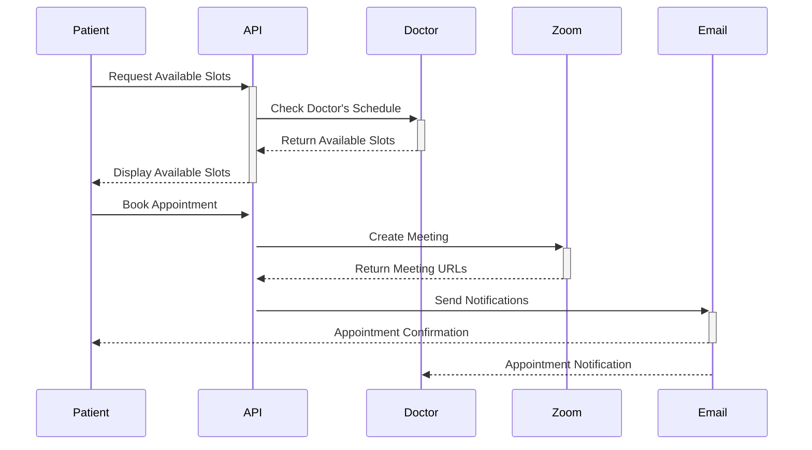
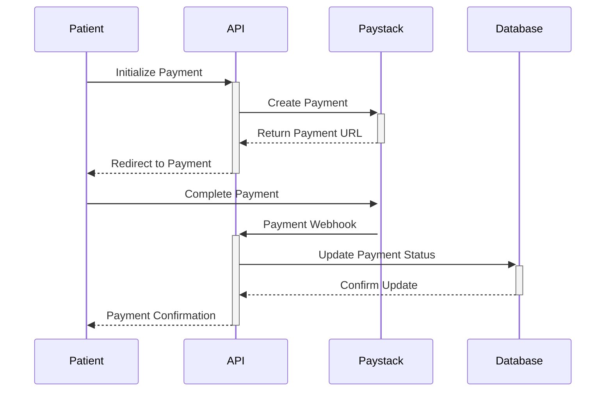

# MedEase API - Healthcare Management System

<p align="center">
  
</p>

MedEase is a comprehensive healthcare management system that provides a robust API for managing medical services, appointments, prescriptions, and payments. The system streamlines healthcare operations by providing secure and efficient endpoints for both healthcare providers and patients.

## 🌐 Live API

- API Endpoint: https://medeaseapi.onrender.com/
- API Documentation (Swagger): https://medeaseapi.onrender.com/api

## 🚀 Features

- 👥 User Management (Patients, Doctors, Admins)
- 🗓️ Appointment Scheduling with Zoom Integration
- 💊 Medication & Prescription Management
- 💰 Secure Payment Processing (Paystack)
- 📋 Medical History Tracking
- 🏥 Medication Stock Management
- 🔒 Role-Based Access Control
- 📧 Email Notifications

## 🛠️ Tech Stack

- NestJS (Backend Framework)
- PostgreSQL (Database)
- TypeORM (ORM)
- Zoom API (Virtual Meetings)
- Paystack (Payment Processing)
- JWT (Authentication)
- Swagger (API Documentation)

## 📝 API Documentation

### Authentication Endpoints

#### Register User

```http
POST /users
Content-Type: application/json

{
  "email": "user@example.com",
  "password": "strongpassword123",
  "role": "PATIENT"
}
```

#### Login

```http
POST /auth/login
Content-Type: application/json

{
  "email": "user@example.com",
  "password": "strongpassword123"
}
```

Response:

```json
{
  "access_token": "your_jwt_token",
  "refresh_token": "your_refresh_token"
}
```

### Password Reset Flow

1. Request Password Reset:

```http
POST /auth/password-reset-request
Content-Type: application/json

{
  "email": "user@example.com"
}
```

Response: Email with OTP and secret will be sent to the user.

2. Reset Password:

```http
POST /auth/password-reset
Content-Type: application/json

{
  "email": "user@example.com",
  "otp": "123456",
  "secret": "received_secret",
  "password": "new_password"
}
```

### Appointment Management

#### Create Appointment

```http
POST /appointments
Authorization: Bearer <token>
Content-Type: application/json

{
  "date": "2025-07-25",
  "time": "10:00 AM",
  "doctorId": 1,
  "patientId": 1,
  "status": "PENDING",
  "title": "General Checkup",
  "duration": 30
}
```

Response:

```json
{
  "id": 1,
  "date": "2025-07-25",
  "time": "10:00 AM",
  "status": "PENDING",
  "user_url": "https://zoom.us/j/123456789",
  "admin_url": "https://zoom.us/s/123456789"
}
```

### Payment Flow

1. Initialize Payment:

```http
POST /payments/paystack-push
Content-Type: application/json

{
  "email": "patient@example.com",
  "amount": 5000,
  "prescriptionId": 1
}
```

Response:

```json
{
  "message": "Payment initialized successfully",
  "data": {
    "authorization_url": "https://checkout.paystack.com/abc123",
    "reference": "ref123"
  }
}
```

2. Verify Payment:
   The system automatically verifies payments through webhook notifications and updates the payment status.

## 🔄 Flow Diagrams

### Appointment Booking Flow



### Payment Flow



## 🚀 Getting Started

1. Clone the repository

```bash
git clone https://github.com/kennedymwaniki/MedeaseApi.git
```

2. Install dependencies

```bash
pnpm install
```

3. Set up environment variables

```bash
cp example.env .env
```

Edit the .env file with your credentials.

4. Run migrations

```bash
pnpm migration:run
```

5. Start the server

```bash
# Development
pnpm run start:dev

# Production
pnpm run start:prod
```

## 📄 Environment Variables

See `example.env` for required environment variables. The file includes configurations for:

- Database connection
- JWT authentication
- Email service (SMTP)
- Paystack integration
- Zoom API
- Supabase storage
- CORS settings
- Rate limiting
- Logging

## 🔐 Security Features

- JWT-based authentication with refresh tokens
- Role-based access control (RBAC)
- Password hashing with bcrypt
- CORS protection
- Rate limiting
- Request validation
- Secure headers
- SQL injection protection

## 📧 Email Templates

The system includes several email templates:

- Welcome email
- Appointment confirmation
- Password reset
- Appointment reminders
- Prescription notifications

## 🧪 Testing

```bash
# Unit tests
pnpm run test

# E2E tests
pnpm run test:e2e

# Test coverage
pnpm run test:cov
```

## 🤝 Contributing

1. Fork the repository
2. Create your feature branch (`git checkout -b feature/amazing-feature`)
3. Commit your changes (`git commit -m 'Add some amazing feature'`)
4. Push to the branch (`git push origin feature/amazing-feature`)
5. Create a Pull Request

## 📝 License

This project is licensed under the MIT License - see the LICENSE file for details.

## 📞 Support

For support, email support@medease.com

## 🌟 Authors

- Kennedy Mwaniki - Initial work

## 🙏 Acknowledgments

- NestJS Team
- Zoom API Team
- Paystack Team
